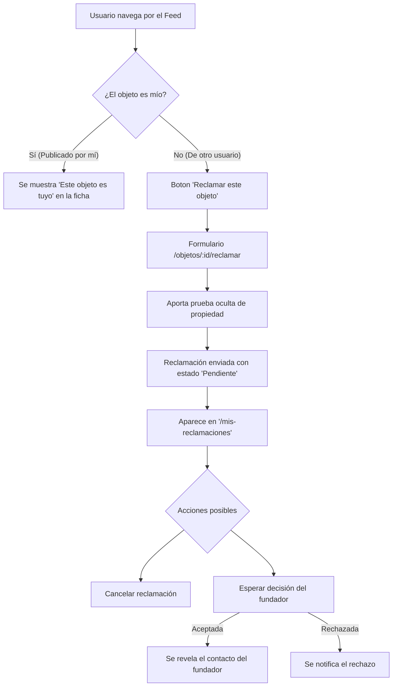

# Feature: Perfil de Usuario y Gestión de Reclamaciones (`features/account`)

> **Área del usuario y ciclo de vida de reclamaciones** en Finder. Permite a los usuarios consultar sus datos, administrar sus objetos publicados, revisar las reclamaciones recibidas de otros usuarios y gestionar sus propias reclamaciones enviadas.

---

## 🚀 Qué se ha desarrollado en esta rama (`feature/perfil-usuario`)

En esta etapa se ha implementado el **flujo completo de usuario autenticado (Lucía Martín)**, integrando la gestión de perfil y el sistema bidireccional de reclamaciones:

1. **Panel Principal de Perfil (`/perfil`)**:
   - Tarjeta personal con avatar, nombre, correo y ciudad (`Lucía Martín — Madrid`).
   - Estadísticas en tiempo real de objetos publicados y reclamaciones activas.
   - Accesos directos a la gestión de objetos propios y reclamaciones.

2. **Mis Objetos Publicados y Reclamaciones Recibidas (`/mis-publicaciones`)**:
   - Pestaña **"Mis publicaciones"**: Listado de los 3 objetos publicados por Lucía (todos localizados en Madrid para dar coherencia y credibilidad).
   - Pestaña **"Reclamaciones recibidas"**: Panel para revisar solicitudes de terceros sobre los objetos propios. Muestra la prueba de propiedad aportada por el solicitante y permite **Aceptar** o **Rechazar** la reclamación. Al aceptar, se desbloquean los datos de contacto directo.

3. **Mis Reclamaciones Enviadas (`/mis-reclamaciones`)**:
   - Listado de reclamaciones realizadas por Lucía sobre objetos encontrados por otros usuarios de la comunidad.
   - Indicador visual de estado (**Pendiente**, **Aceptada**, **Rechazada**).
   - **Botón "Cancelar reclamación"**: Permite al usuario retirar un mensaje de reclamación enviado por error o arrepentimiento.

4. **Formulario de Reclamar Objeto (`/objetos/:id/reclamar`)**:
   - Accesible desde la ficha de cualquier objeto de la comunidad.
   - Formulario validado con `react-hook-form` y `zod` en español.
   - El usuario debe aportar una **prueba de propiedad** (detalles no visibles en la foto o descripción pública, como grabados o contenido del interior).

---

## 📁 Estructura y Componentes de `features/account`

| Archivo / Componente | Descripción y Responsabilidad |
|---|---|
| [`profile-page.tsx`](file:///c:/Users/Borja/Documents/GitHub/finder-objetos-perdidos/apps/web/src/features/account/profile-page.tsx) | Pantalla principal de resumen del perfil de usuario y métricas rápidas. |
| [`my-items-page.tsx`](file:///c:/Users/Borja/Documents/GitHub/finder-objetos-perdidos/apps/web/src/features/account/my-items-page.tsx) | Gestión de objetos propios y solicitudes recibidas con acciones para Aceptar/Rechazar. |
| [`my-claims-page.tsx`](file:///c:/Users/Borja/Documents/GitHub/finder-objetos-perdidos/apps/web/src/features/account/my-claims-page.tsx) | Gestión de reclamaciones salientes y opción de cancelación de solicitudes pendientes. |
| [`use-my-items.ts`](file:///c:/Users/Borja/Documents/GitHub/finder-objetos-perdidos/apps/web/src/features/account/use-my-items.ts) | Custom hook para consultar los objetos publicados por el usuario actual. |
| [`use-my-claims.ts`](file:///c:/Users/Borja/Documents/GitHub/finder-objetos-perdidos/apps/web/src/features/account/use-my-claims.ts) | Custom hook para consultar las reclamaciones enviadas por el usuario. |
| [`use-claims-on-my-items.ts`](file:///c:/Users/Borja/Documents/GitHub/finder-objetos-perdidos/apps/web/src/features/account/use-claims-on-my-items.ts) | Custom hook para obtener las reclamaciones entrantes de los objetos propios. |
| [`claim-item-page.tsx`](file:///c:/Users/Borja/Documents/GitHub/finder-objetos-perdidos/apps/web/src/features/item-detail/claim-item-page.tsx) | Pantalla con formulario de reclamación para objetos ajenos. |

---

## 🔄 Flujos y Formas de Reclamar

### 1. ¿Cómo reclamar un objeto ajeno?
1. Desde la vista de detalle de cualquier objeto publicado por otro usuario de la comunidad, haz clic en **"Reclamar este objeto"**.
2. Rellena la **prueba de propiedad** describiendo detalles específicos que demuestren que es tuyo (por ejemplo: *"Tiene una raya en la tapa trasera"* o *"En la billetera hay una foto en blanco y negro"*).
3. Envía el formulario. La solicitud quedará guardada con estado **Pendiente** y la verás en `/mis-reclamaciones`.

### 2. ¿Cómo cancelar una reclamación enviada?
1. Ve a `/mis-reclamaciones`.
2. En cualquier tarjeta de reclamación con estado **Pendiente**, haz clic en el botón **"Cancelar reclamación"**.
3. Confirma la acción. La reclamación se eliminará de la base de datos y la persona que encontró el objeto dejará de verla.

### 3. ¿Cómo gestionar una reclamación recibida en un objeto que has publicado?
1. Ve a `/mis-publicaciones` y selecciona la pestaña **"Reclamaciones recibidas"**.
2. Lee la prueba aportada por la otra persona.
3. Haz clic en **"Aceptar reclamación"** si la prueba coincide, o **"Rechazar"** si es incorrecta.
4. Al aceptar, la plataforma facilita los datos de contacto (email y nombre) para acordar la devolución.

---

## 🎨 Cumplimiento de Reglas del Proyecto

- **Solo componentes de `shadcn/ui`**: Construido íntegramente con `Card`, `Button`, `Badge`, `Tabs`, `Alert`, `Skeleton`, `Dialog`, `Form` y componentes oficiales de `components/ui/`.
- **4 Estados de UI**: Todas las pantallas contemplan estado **cargando** (Skeletons), **error** (Alerts interactivos), **vacío** (Empty state con acción) y **con datos**.
- **Servicios unificados**: Capa de datos accesible únicamente mediante `services.*`, respaldada por `services/types.ts`, `services/mock/` y `services/firebase/`.
