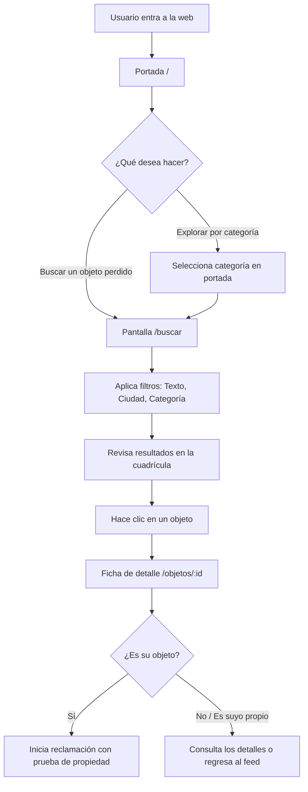

# Feature: Feed y Búsqueda de Objetos (`features/search`)

> **Catálogo principal y buscador de objetos perdidos y encontrados** en Finder. Es la puerta de entrada para explorar publicaciones, filtrar por ubicación o categoría y consultar la información detallada de cada hallazgo.

---

## 🚀 Qué se desarrolló en esta rama (`feature/feed-objetos`)

En esta primera fase se implementó la experiencia completa de navegación y búsqueda de objetos:

1. **Fotografías Reales de Objetos**:
   - Sustitución de imágenes genéricas de catálogo por fotos realistas de objetos cotidianos con desgaste, marcas de uso o fondos urbanos/domésticos reales.

2. **Catálogo Interactivo y Búsqueda (`/` y `/buscar`)**:
   - Buscador por palabra clave (título o descripción).
   - Filtros por **Categoría** (Carteras, Electrónica, Llaves, Joyería, Gafas, Ropa, Deportes, Documentos...).
   - Filtros por **Ciudad** (Madrid, Barcelona, Valencia, Bilbao, Sevilla...).
   - Ordenación por fecha de publicación (más recientes primero).

3. **Ficha de Detalle de Objeto (`/objetos/:id`)**:
   - Vista ampliada con la fotografía real del objeto.
   - Información de ubicación exacta (p. ej., *"Parque del Retiro, cerca del estanque"*).
   - Datos del usuario que ha publicado el hallazgo.
   - Indicador dinámico de estado (*Publicado*, *Reclamado*, *Devuelto*).
   - Botón directo para iniciar la reclamación si el objeto no pertenece al usuario autenticado.

4. **Portada Principal (`/`)**:
   - Hero section de bienvenida para la comunidad.
   - Acceso rápido a las categorías principales.
   - Sección de objetos recién encontrados y llamada a la acción para publicar o buscar.

---

## 📁 Estructura y Componentes de `features/search`

| Archivo / Componente | Descripción y Responsabilidad |
|---|---|
| [`borja-home-page.tsx`](file:///c:/Users/Borja/Documents/GitHub/finder-objetos-perdidos/apps/web/src/features/search/borja-home-page.tsx) | Página principal con Hero, accesos directos por categorías y carrusel de objetos recientes. |
| [`search-page.tsx`](file:///c:/Users/Borja/Documents/GitHub/finder-objetos-perdidos/apps/web/src/features/search/search-page.tsx) | Pantalla de búsqueda completa con barra lateral de filtros, selector de ciudad y cuadrícula de resultados. |
| [`item-card.tsx`](file:///c:/Users/Borja/Documents/GitHub/finder-objetos-perdidos/apps/web/src/features/search/item-card.tsx) | Tarjeta visual reutilizable para mostrar un objeto en el feed o resultados de búsqueda. |
| [`use-search-items.ts`](file:///c:/Users/Borja/Documents/GitHub/finder-objetos-perdidos/apps/web/src/features/search/use-search-items.ts) | Custom hook que gestiona la consulta de datos al servicio y aplica filtros dinámicos. |
| [`item-detail-page.tsx`](file:///c:/Users/Borja/Documents/GitHub/finder-objetos-perdidos/apps/web/src/features/item-detail/item-detail-page.tsx) | Pantalla detallada de un objeto concreto con toda su información pública. |

---

## 🔄 Flujo de Navegación y Búsqueda

---

## 🎨 Cumplimiento de Reglas del Proyecto

- **Piezas exclusivas de `shadcn/ui`**: Construido con `Card`, `Badge`, `Input`, `Select`, `Button`, `Skeleton` y `Alert` de `components/ui/`.
- **4 Estados de UI**: Gestión completa de estado **cargando** (Grid de Skeletons), **error** (Alert con botón de reintentar), **vacío** (Empty state indicando que no hay coincidencias) y **con datos**.
- **Capa de Servicios**: Los datos pasan por `services.searchItems(...)` desacoplando la UI de la fuente de datos.
- **Términos del producto**: Eliminada cualquier referencia a "simular" o datos de prueba en la interfaz pública.
